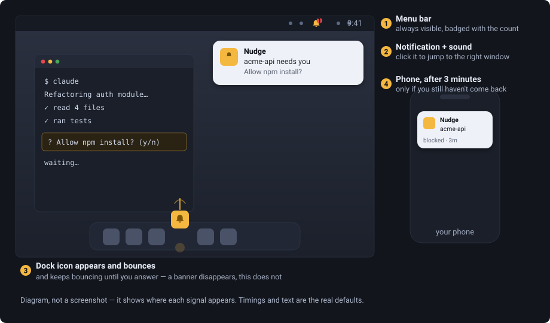

# Nudge: get notified when Claude Code is waiting on you

**Desktop notifications, a bouncing Dock icon, and phone alerts for Claude
Code.** Nudge tells you the moment your AI coding agent is blocked on a
permission prompt, is asking a question, or has finished a task, so you stop
losing time to a terminal window you cannot see.

Works with **Claude Code** in the terminal, in **VS Code**, in **Cursor**, and
in **Windsurf**, plus the Claude desktop app.

You ask an agent to do something, switch to your browser, and come back ten
minutes later to find it never moved. It was sitting on "Allow npm install?"
the whole time. Nudge closes that gap: a desktop notification the instant a
session blocks, a Dock icon that keeps bouncing until you deal with it, and a
push to your phone if you have walked away entirely.

[](https://github.com/shaaz1000/nudge/actions/workflows/ci.yml)
[](LICENSE)

---

## Before and after

**Before**

```
09:41  you ask Claude to refactor the auth module
09:41  Claude runs a few tools, then hits "Allow npm install? (y/n)"
09:41  you tab away to Slack
09:58  you come back. Nothing has happened for 17 minutes.
```

Nothing told you. The terminal was one window behind, the question was one
line of text, and the agent was perfectly happy to wait forever.

**After**

```
09:41  Claude hits "Allow npm install?"
09:41  → notification banner: "my-repo needs you — Allow npm install?"
09:41  → alert sound
09:41  → Dock icon appears and starts bouncing, and keeps bouncing
09:44  → still unanswered? your phone buzzes
09:44  you click the notification; the right VS Code window comes forward
```

The Dock bounce is the part that matters. A banner disappears after a few
seconds, so one glance away loses it. A bouncing icon is still bouncing when
you get back from the kitchen.

---

## What it looks like



And from the terminal — this is real output, with paths and project names
genericised:

```console
$ nudge status
config    /Users/you/.nudge/config.json
socket    /Users/you/.nudge/engine.sock
detail    minimal
muted     false
channel   ntfy
adapters  ntfy
engine    running

$ nudge list
blocked     acme-api                       3s  Allow npm install?
idle-short  docs-site                  12m 04s
stalled     old-experiment             24m 14s
```

`blocked` is a prompt waiting on you — that one bounces the Dock and escalates
to your phone. `idle-short` is a turn that finished. `stalled` is a session
that has gone quiet for 15 minutes.

---

## What you get

| | |
|---|---|
| **Desktop alert** | Native notification plus a per-tier sound, the instant a session blocks. |
| **Persistent attention** | macOS: the Dock icon appears and bounces until the wait clears. Windows/Linux: taskbar flash. |
| **Phone push** | Via [ntfy](https://ntfy.sh) if nobody responds within a few minutes. Your own topic, free, no account. |
| **Click to jump** | Clicking the notification brings the right editor window forward — VS Code, Cursor, Windsurf, the Claude desktop app, or your terminal. |
| **VS Code extension** | Status bar item for *this window's* sessions, a toast, and click-to-jump inside the editor. |
| **Knows where you're looking** | Won't nag you about the window you're already in. |
| **Snooze / mute** | Per session, per project, or everything. Plus quiet hours for phone pushes. |

Everything runs locally. The only thing that ever leaves your machine is the
phone push, and by default it carries just a project name and a status — never
the actual question or command.

---

## Quick start

Requires **Node 22.5+** (the engine uses the built-in `node:sqlite`).

```bash
git clone https://github.com/shaaz1000/nudge.git
cd nudge
npm install
npx tsc --build                      # required — packages resolve via dist/

node packages/cli/dist/bin.js setup --dry-run   # see exactly what it will change
node packages/cli/dist/bin.js setup             # install hooks + start the engine
```

That's the whole core install. Trigger a permission prompt in Claude Code and
you should get a notification and a sound within a second or two.

Give yourself an alias so the rest is readable:

```bash
alias nudge="node $HOME/path/to/nudge/packages/cli/dist/bin.js"
```

```
nudge setup [--dry-run]   install hooks into Claude Code and register the engine
nudge uninstall           remove exactly the hooks Nudge added
nudge start               start the engine in the background
nudge status              config, channel, and engine health
nudge list                what is waiting on you right now
nudge test [channel]      send a test alert to your phone
nudge snooze <id> [min]   snooze a session (default 10 minutes)
nudge mute [off]          mute or unmute all alerts
```

**→ [INSTALL.md](INSTALL.md) is the full guide**: the desktop app, the VS Code
extension, what gets written where, and every config key.

---

## Phone notifications (set up your own ntfy)

Nudge escalates to your phone if a session stays blocked past
`escalation.activeDelayMs` (3 minutes by default). It uses **your own ntfy
topic** — there is no shared server, no account, and nothing of yours is
routed through anything of mine.

Install the ntfy app ([iOS](https://apps.apple.com/us/app/ntfy/id1625396347) ·
[Android](https://play.google.com/store/apps/details?id=io.heckel.ntfy)), then:

### 1. Generate a topic — and treat it as a password

> [!IMPORTANT]
> On the public `ntfy.sh` server there are **no accounts and no access
> control**. A topic is just a URL. Anyone who knows or guesses your topic can
> read every notification you receive and send you fake ones. A topic named
> `nudge`, `claude`, or `your-name` is **not private**.

Generate something unguessable:

```bash
echo "nudge-$(openssl rand -hex 16)"
```

### 2. Put it in `~/.nudge/config.json`

```json
{
  "channel": {
    "id": "ntfy",
    "options": {
      "topic": "nudge-PASTE-YOUR-GENERATED-TOPIC-HERE"
    }
  }
}
```

### 3. Subscribe on your phone and test

Open the ntfy app → **+** → paste the same topic. Then:

```bash
nudge test
```

Your phone should buzz. If it doesn't, compare the topic on both sides
character by character — a mismatch means you're subscribed to a topic with no
messages, which looks exactly like a broken setup.

**Want it fully private?** Self-host ntfy and point `serverUrl` at it:

```json
{ "channel": { "id": "ntfy", "options": {
    "serverUrl": "https://ntfy.example.com",
    "topic": "nudge-...",
    "token": "tk_..."
} } }
```

---

## Configuration

Everything lives in `~/.nudge/config.json`. Every field is optional; an unknown
key or wrong-shaped value fails loudly at load rather than being ignored.

```jsonc
{
  "detailLevel": "minimal",     // "full" puts the real question text in phone pushes
  "muted": false,

  "escalation": {
    "activeDelayMs": 180000,    // wait before the phone push
    "localRepeat": 3            // repeat the desktop alert this many times
  },

  "quietHours": { "start": "23:00", "end": "07:00" },   // phone only, never desktop

  "tiers": {
    "blocked":    { "enabled": true, "sound": "blocked", "escalates": true },
    "idle-short": { "enabled": true, "sound": null,      "escalates": false }
  },

  "tray": {                                    // desktop app only
    "bounceTiers": ["blocked", "idle-long"]
  },

  "projects": { "/path/to/a/repo": { "muted": true } }
}
```

`config.json` is parsed with `JSON.parse`, so the comments above are
illustrative — don't paste them in.

**Tiers** are how loud each situation is: `blocked` (a prompt is waiting),
`idle-long` (a long turn finished), `idle-short` (a short turn finished),
`stalled` (no activity for 15 minutes).

---

## How it works

```
Claude Code fires a hook
  → nudge-hook        exits in <500ms, always exit 0, never writes stdout
    → engine          over a 0600 Unix socket (named pipe on Windows)
      → desktop notification + sound, immediately
      → still waiting after the delay? → your phone via ntfy
```

The hook is deliberately dumb and fast: it forwards a normalized event and
exits. If the engine isn't running, events spool to disk and replay on its next
boot, so nothing is lost. A notifier that can stall your coding session is
worse than no notifier.

One wrinkle worth knowing: when Claude asks a **multiple-choice question**, that
does *not* fire Claude Code's `Notification` hook
([claude-code#59908](https://github.com/anthropics/claude-code/issues/59908)).
Nudge catches it via `PreToolUse` instead — which is why it subscribes to seven
hooks rather than one.

`nudge setup` only ever touches hook entries carrying its own `_nudge` marker,
takes a timestamped backup first, and `nudge uninstall` removes exactly those
and nothing else.

---

## Troubleshooting

**Nothing happens at all.**
Run `nudge status`. If the engine isn't running, `nudge start`. If it won't
stay up, check `node --version` — below 22.5 it dies on `node:sqlite` with
`ERR_UNKNOWN_BUILTIN_MODULE`.

**Hooks aren't firing.**
```bash
grep -c _nudge ~/.claude/settings.json    # expect 7
```
If that's 0, re-run `nudge setup`. Restart Claude Code afterwards — it reads
settings at startup.

**The phone never buzzes.**
`nudge test` isolates it. If that works, the channel is fine and the 3-minute
escalation delay simply hasn't elapsed. If it doesn't, check the topic matches
on both sides, and that `quietHours` isn't covering the current time — it
suppresses phone pushes only, which looks identical to a dead channel.

**Sound and Dock bounce, but no notification banner** (macOS desktop app).
The bundle's signature is wrong, and macOS drops its notifications silently:
```bash
codesign -dv /Applications/Nudge.app 2>&1 | grep Identifier
```
If that says `Identifier=Electron` instead of `com.nudge.tray`:
```bash
codesign --force --deep --sign - /Applications/Nudge.app
```

**Clicking a notification opens the wrong app.**
The editor is detected once, at session start, so an existing session keeps
whatever was recorded then. Start a new session.

More in [INSTALL.md § Troubleshooting](INSTALL.md#10-troubleshooting).

---

## Platform support

| | Desktop alert | Dock bounce / taskbar flash | Phone | Click-to-focus |
|---|---|---|---|---|
| **macOS** | ✅ verified | ✅ verified | ✅ verified | ✅ verified |
| **Linux** | ✅ | ⚠️ unverified | ✅ | ✅ |
| **Windows** | ✅ | ⚠️ unverified | ✅ | ✅ |

⚠️ **Honest caveat:** the Windows and Linux taskbar flash is implemented and
exercised in CI on real Windows and Linux runners, but **nobody has watched a
taskbar actually flash** — development happened on macOS. `flashFrame` against
a window with no taskbar button is a silent no-op, and no automated check can
see the difference. If you run either platform, [telling us whether it actually
flashes](https://github.com/shaaz1000/nudge/issues) is genuinely the single
most useful contribution right now.

---

## FAQ

**How do I get notified when Claude Code finishes a task?**
Install Nudge and run `nudge setup`. When a turn finishes you get a desktop
notification, and if the turn ran longer than three minutes you also get a
sound and a bouncing Dock icon. You can turn the bounce on for every finished
turn with `tray.bounceTiers` in the config.

**How do I know when Claude Code is waiting for permission?**
That is the main thing Nudge is for. The moment a session blocks on a
permission prompt or a question, you get a notification, a sound, and a Dock
icon that keeps bouncing until you answer it.

**Can I get Claude Code notifications on my phone?**
Yes, through [ntfy](https://ntfy.sh). You create your own topic, subscribe on
your phone, and Nudge pushes to it if you have not responded within a few
minutes. There is no account and no server of ours in the middle. You can also
self host ntfy if you would rather nothing touched a public server.

**Does it work with Cursor, Windsurf, or the Claude desktop app?**
Yes. Nudge detects which surface a session is running in, and clicking the
notification brings that window forward. Supported: VS Code, Cursor, Windsurf,
the Claude desktop app, Terminal.app, iTerm2, and Windows Terminal.

**Does Nudge send my code or my prompts anywhere?**
No. Everything runs locally over a `0600` unix socket. There is no telemetry,
no analytics, and no update check. The only thing that ever leaves your machine
is the phone push, and by default that carries just a project name and a status,
never the question text or the command. Setting `detailLevel` to `"full"` is
what changes that, and it is off by default for this reason.

**Does it work on Windows and Linux?**
The core does: hooks, desktop notifications, phone push, and click to focus all
work on all three platforms. The taskbar flash on Windows and Linux is written
and runs in CI, but no human has confirmed it visibly flashes yet. macOS is the
platform verified end to end.

**Will it slow down Claude Code?**
No. The hook process forwards one event and exits, with a hard budget of 500ms,
and it always exits 0 so it can never fail your session. If the daemon is not
running, events spool to disk and replay later.

**Is it free?**
Yes, MIT licensed and open source. No account, no paid tier, no hosted service.

**Why not just watch the terminal?**
Because you will not. The whole failure mode is that you tabbed away, and a
notification banner disappears after a few seconds. A Dock icon that is still
bouncing when you come back from the kitchen is the part that actually changes
the outcome.

**How does it hook into Claude Code?**
Through Claude Code's own hooks system. `nudge setup` adds seven hook entries
to your settings, marked so it can remove exactly its own entries later, and
takes a backup first. Worth knowing: multiple choice questions do not fire
Claude Code's `Notification` hook
([claude-code#59908](https://github.com/anthropics/claude-code/issues/59908)),
so Nudge catches those through `PreToolUse` instead.

**Is there something like this for other agents?**
Not yet. The event ingestion is Claude Code specific today, but the daemon,
the alert tiers and the channels are agent agnostic, so adding another source
is a contained piece of work. Contributions welcome.

---

## Contributing

Contributions are very welcome — see **[CONTRIBUTING.md](CONTRIBUTING.md)**.

`main` is protected, so the flow is fork → branch → pull request. Good first
things to pick up:

- **Verify Windows or Linux** (see the caveat above) — no code needed, just eyes.
- **A new phone channel.** ntfy is one adapter behind a small interface;
  Pushover, Discord, Slack and Telegram would all slot in the same way.
- **Linux autostart**, mirroring the macOS LaunchAgent installer.

Every change needs a test that fails without it. This project has found
**seventeen tests that could not fail** — assertions that passed against a
broken implementation — so that bar is taken seriously and explained in
CONTRIBUTING.md.

```bash
npm test                        # 743 tests
npx tsc --build                 # build
npx tsc -p tsconfig.test.json   # type-check the tests too
```

---

## License

[MIT](LICENSE) © Shaaz Khan
